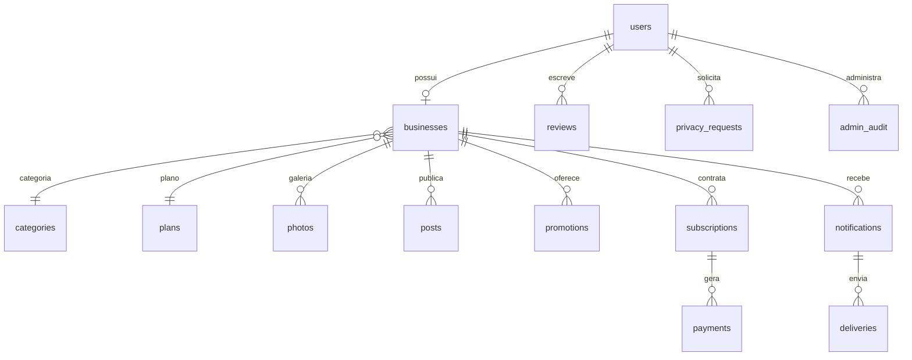

# Arquitetura e banco de dados

## Estrutura

- `public/`: único diretório servido pela hospedagem. Interface, imagens, PWA e entrada de API.
- `server/bootstrap.php`: ambiente, PDO, sessão/validação e funções de acesso.
- `server/api.php`: contas, consulta pública, fotos, publicações, avaliações e rotas de pagamento.
- `server/features.php`: cadastros completos, promoções, campanha, administração e privacidade.
- `server/payments.php`: cliente Asaas, assinatura Pix, fatura e aplicação idempotente do estado financeiro.
- `server/finance.php`: indicadores, previsão de captação e série mensal.
- `server/google.php`: OAuth Google e cliente HTTP de integrações.
- `server/notifications.php`: fila, envio via Resend/Twilio e conciliação financeira.
- `database/`: schema e migrações.
- `scripts/`: instalação, criação de administrador, geração de assets e worker.
- `storage/`: SQLite, acesso local e arquivos operacionais privados. Nunca expor na web.
- `tests/`: API, regras financeiras, segurança funcional e jornadas no navegador.

Sem framework PHP externo nesta primeira versão. PDO usa parâmetros para consultas. Recursos financeiros e uploads são validados no servidor. O navegador não decide prazo, valor, prioridade nem permissão administrativa.

## Modelo relacional

`plans`: preço em centavos, limite de fotos/publicações/promoções, prioridade.

`businesses`: dono, tipo empresa/autônomo, plano em uso, interesse comercial, descrição, contatos, endereço, links, preferências, consentimento, prazo de cinco dias, degustação, cortesia e validade paga.

`subscriptions`: vínculo do cadastro/plano com assinatura Pix do Asaas. Estados locais `creating`, `pending`, `active`, `cancelled`. `creating` persistido antes da chamada externa evita criar uma segunda assinatura inadvertidamente após timeout.

`payments`: ID único do provedor, valor bruto, vencimento, status, pagamento, prazo e estorno. Valores monetários locais são inteiros, em centavos.

`webhook_events`: ID único da notificação já processada. A aplicação consulta o estado atual no provedor antes de aplicar um evento, evitando regressão por eventos atrasados. A operação de acesso é também idempotente por pagamento.

`notifications` guarda o aviso com chave de deduplicação; `deliveries` separa cada canal e tentativa. `admin_audit` registra acessos detalhados e ações administrativas. `settings` guarda campanha e canais do responsável, sem chaves de API.

## API resumida

Todas as rotas abaixo têm prefixo `/api`. JSON UTF-8; erros retornam `{ "error": "mensagem" }`. Mutações requerem `X-CSRF-Token` obtido em `/session`. Cookies são HttpOnly e SameSite=Lax; Secure em produção.

| Método | Rota | Acesso |
|---|---|---|
| GET | `/session`, `/catalog` | Público |
| GET | `/businesses?q=&category=&neighborhood=&sort=` | Público; até 100 resultados |
| GET | `/businesses/{id}`, `/promotions` | Público, condicionado à vigência |
| POST | `/register`, `/login`, `/logout` | CSRF e rate limit no acesso |
| POST | `/auth/google/start` | CSRF e ciência da privacidade |
| GET | `/auth/google/callback` | State de uso único e prazo de 10 minutos |
| GET/POST | `/me/business` | Proprietário |
| POST | `/me/photos` | Proprietário; multipart `photo`, `kind` |
| DELETE | `/me/photos/{id}` | Proprietário |
| POST | `/me/posts`, `/me/promotions` | Proprietário com período ativo |
| DELETE | `/me/promotions/{id}` | Proprietário |
| POST | `/businesses/{id}/reviews` | Conta autenticada, exceto proprietário |
| POST | `/me/checkout`, `/me/cancel-subscription` | Proprietário |
| POST | `/me/demo-pay` | Apenas modo local e pagamento demo |
| POST | `/webhook` | Segredo exclusivo e consulta ao Asaas |
| GET | `/me/export` | Dono dos dados |
| POST | `/me/privacy-request` | Conta autenticada |
| GET | `/admin/overview`, `/admin/businesses/{id}` | Papel admin verificado no servidor |
| POST | `/admin/businesses/{id}/activate\|suspend\|restore` | Admin + motivo |
| POST | `/admin/settings` | Admin |
| POST | `/admin/privacy/{id}/close` | Admin + resposta |
| POST | `/admin/notifications/{id}/done` | Admin |

## Segurança implementada

Hash de senha PHP; regeneração do ID de sessão ao autenticar; RBAC; CSRF; query parametrizada; rejeição de links javascript; domínio validado para Google Maps; imagens raster verificadas e recodificadas para JPG; limite de bytes e pixels; nomes aleatórios para upload; proteção contra execução de arquivos no Apache; escaping dos textos por AngularJS; acesso às empresas condicionado por tempo; logs de administração; segredos fora de `public`.

Dados de API e uploads não são cacheados pelo service worker. A PWA mostra uma página explicativa sem internet e não apresenta cobranças antigas como se estivessem atualizadas.

## Limitações técnicas conhecidas

O primeiro MVP retorna no máximo 100 empresas e 30 promoções na consulta. Antes de um catálogo maior, implementar paginação e busca indexada. A série financeira percorre os pagamentos e funciona bem na escala inicial; migrar para agregações e paginação ao crescer. Migrações MySQL usam DDL não transacional: backup obrigatório antes de evolução. A interface AngularJS é legada e deve ser substituída ou receber suporte estendido antes de produção aberta.
